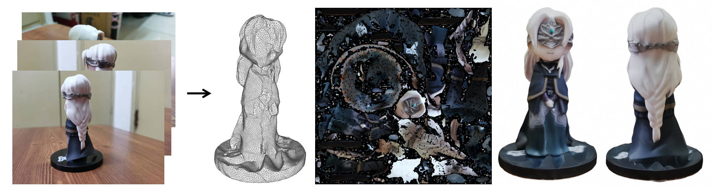
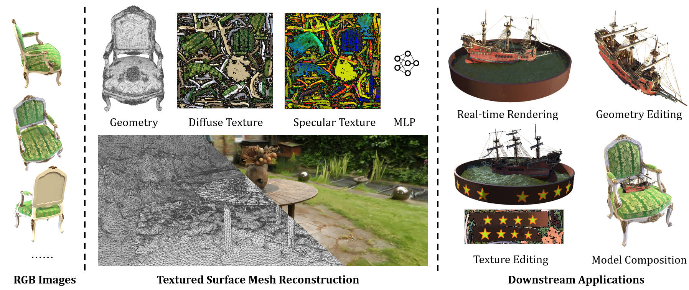

# nerf2mesh


This repository contains a PyTorch re-implementation of the paper: [Delicate Textured Mesh Recovery from NeRF via Adaptive Surface Refinement](https://arxiv.org/abs/2303.02091).

### [Project Page](https://ashawkey.github.io/nerf2mesh/) | [Arxiv](https://arxiv.org/abs/2303.02091) | [Paper](https://huggingface.co/ashawkey/nerf2mesh/resolve/main/paper.pdf) | [Models](https://huggingface.co/ashawkey/nerf2mesh/tree/main/scenes) 

**News (2023.5.3)**: support [background removal](https://github.com/OPHoperHPO/image-background-remove-tool) and [SDF](https://github.com/Totoro97/NeuS) mode for stage 0, which produces more robust and smooth mesh for single-object reconstruction:





# Install

```bash
git clone https://github.com/ashawkey/nerf2mesh.git
cd nerf2mesh
```

### Install with pip
```bash
pip install -r requirements.txt

# tiny-cuda-nn
pip install git+https://github.com/NVlabs/tiny-cuda-nn/#subdirectory=bindings/torch

# nvdiffrast
pip install git+https://github.com/NVlabs/nvdiffrast/

# pytorch3d
pip install git+https://github.com/facebookresearch/pytorch3d.git
```

### Build extension (optional)
By default, we use [`load`](https://pytorch.org/docs/stable/cpp_extension.html#torch.utils.cpp_extension.load) to build the extension at runtime.
However, this may be inconvenient sometimes.
Therefore, we also provide the `setup.py` to build each extension:
```bash
# install all extension modules
bash scripts/install_ext.sh

# if you want to install manually, here is an example:
cd raymarching
python setup.py build_ext --inplace # build ext only, do not install (only can be used in the parent directory)
pip install . # install to python path (you still need the raymarching/ folder, since this only install the built extension.)
```

### Tested environments
* Ubuntu 22 with torch 1.12 & CUDA 11.6 on a V100.

# Usage

We support the original NeRF data format like [nerf-synthetic](https://drive.google.com/drive/folders/128yBriW1IG_3NJ5Rp7APSTZsJqdJdfc1), and COLMAP dataset like [Mip-NeRF 360](http://storage.googleapis.com/gresearch/refraw360/360_v2.zip).
Please download and put them under `./data`.

First time running will take some time to compile the CUDA extensions.

### Basics
```bash
### Stage0 (NeRF, continuous, volumetric rendering), this stage exports a coarse mesh under <workspace>/mesh_stage0/

# nerf
python main.py data/nerf_synthetic/lego/ --workspace trial_syn_lego/ -O --bound 1 --scale 0.8 --dt_gamma 0 --stage 0 --lambda_tv 1e-8

# colmap
python main.py data/garden/ --workspace trial_360_garden -O --data_format colmap --bound 16 --enable_cam_center --enable_cam_near_far --scale 0.3 --downscale 4 --stage 0 --lambda_entropy 1e-3 --clean_min_f 16 --clean_min_d 10 --lambda_tv 2e-8 --visibility_mask_dilation 50

### Stage1 (Mesh, binarized, rasterization), this stage exports a fine mesh with textures under <workspace>/mesh_stage1/

# nerf
python main.py data/nerf_synthetic/lego/ --workspace trial_syn_lego/ -O --bound 1 --scale 0.8 --dt_gamma 0 --stage 1

# colmap
python main.py data/garden/ --workspace trial_360_garden   -O --data_format colmap --bound 16 --enable_cam_center --enable_cam_near_far --scale 0.3 --downscale 4 --stage 1 --iters 10000

### Web Renderer
# you can simply open <workspace>/mesh_stage1/mesh.obj with a 3D viewer to visualize the diffuse texture.
# to render full diffuse + specular, you'll need to host this folder (e.g., by vscode live server), and open renderer.html for further instructions.
```

### Custom Dataset

**Tips:**
* To get best mesh quality, you may need to adjust `--scale` to let the most interested object fall inside the unit box `[-1, 1]^3`, which can be visualized by appending `--vis_pose`.
* To better model background (especially for outdoor scenes), you may need to adjust `--bound` to let most sparse points fall into the full box `[-bound, bound]^3`, which can also be visualized by appending `--vis_pose`.
* For single object centered captures focusing on mesh assets quality:
  * remove the background by `scripts/remove_bg.py` and only reconstruct the targeted object.
  * use `--sdf` to enable sdf based stage 0 model.
  * use `--diffuse_only` if you only want to get the diffuse texture.
  * adjust `--decimate_target 1e5` to control stage 0 number of mesh faces, and adjust `--refine_remesh_size 0.01` to control stage 1 number of mesh faces (average edge length).
  * adjust `--lambda_normal 1e-2` for more smooth surface.
* For forward-facing captures:
  * remove `--enable_cam_center` so the scene center is determined by sparse points instead of camera positions.

```bash
# prepare your video or images under /data/custom, and run colmap (assumed installed):
python scripts/colmap2nerf.py --video ./data/custom/video.mp4 --run_colmap # if use video
python scripts/colmap2nerf.py --images ./data/custom/images/ --run_colmap # if use images

# generate downscaled images if resolution is very high and OOM (asve to`data/<name>/images_{downscale}`) 
python scripts/downscale.py data/<name> --downscale 4
# NOTE: remember to append `--downscale 4` as well when running main.py

# perform background removal for single object 360 captures (save to 'data/<name>/mask')
python scripts/remove_bg.py data/<name>/images
# NOTE: the mask quality depends on background complexity, do check the mask!

# recommended options for single object 360 captures
python main.py data/custom/ --workspace trial_custom -O --data_format colmap --bound 1 --dt_gamma 0 --stage 0 --clean_min_f 16 --clean_min_d 10 --visibility_mask_dilation 50 --iters 10000 --decimate_target 1e5 --sdf
# NOTE: for finer faces, try --decimate_target 3e5

python main.py data/custom/ --workspace trial_custom -O --data_format colmap --bound 1 --dt_gamma 0 --stage 1 --iters 5000 --lambda_normal 1e-2 --refine_remesh_size 0.01 --sdf
# NOTE: for finer faces, try --lambda_normal 1e-1 --refine_remesh_size 0.005

# recommended options for outdoor 360-inwarding captures
python main.py data/custom/ --workspace trial_custom -O --data_format colmap --bound 16 --enable_cam_center --enable_cam_near_far --stage 0 --lambda_entropy 1e-3 --clean_min_f 16 --clean_min_d 10 --lambda_tv 2e-8 --visibility_mask_dilation 50

python main.py data/custom/ --workspace trial_custom -O --data_format colmap --bound 16 --enable_cam_center --enable_cam_near_far --stage 1 --iters 10000 --lambda_normal 1e-3

# recommended options for forward-facing captures
python main.py data/custom/ --workspace trial_custom -O --data_format colmap --bound 2 --scale 0.1 --stage 0 --clean_min_f 16 --clean_min_d 10 --lambda_tv 2e-8 --visibility_mask_dilation 50

python main.py data/custom/ --workspace trial_custom -O --data_format colmap --bound 2 --scale 0.1 --stage 1 --iters 10000 --lambda_normal 1e-3
```

### Advanced Usage
```bash
### -O: the recommended setting, equals
--fp16 --preload --mark_untrained --random_image_batch --adaptive_num_rays --refine --mesh_visibility_culling

### load checkpoint
--ckpt latest # by default we load the latest checkpoint in the workspace
--ckpt scratch # train from scratch. For stage 1, this will still load the stage 0 model as an initialization.
--ckpt trial/checkpoints/xxx.pth # specify it by path

### testing
--test # test, save video and mesh
--test_no_video # do not save video
--test_no_mesh # do not save mesh

### dataset related
--data_format [colmap|nerf|dtu] # dataset format
--enable_cam_center # use camera center instead of sparse point center as scene center (colmap dataset only)
--enable_cam_near_far # estimate camera near & far from sparse points (colmap dataset only)

--bound 16 # scene bound set to [-16, 16]^3, note that only meshes inside the center [-1, 1]^3 will be adaptively refined!
--scale 0.3 # camera scale, if not specified, automatically estimate one based on camera positions. Important targets should be scaled into the center [-1, 1]^3.

### visualization 
--vis_pose # viusalize camera poses and sparse points (sparse points are colmap dataset only)
--gui # open gui (only for testing, training in gui is not well supported!)

### balance between surface quality / rendering quality

# increase these weights to get better surface quality but worse rendering quality
--lambda_tv 1e-7 # total variation loss (stage 0)
--lambda_entropy 1e-3 # entropy on rendering weights (transparency, alpha), encourage them to be either 0 or 1 (stage 0)
--lambda_lap 0.001 # laplacian smoothness loss (stage 1)
--lambda_normal 0.001 # normal consistency loss (stage 1)
--lambda_offsets 0.1 # vertex offsets L2 loss (stage 1)
--lambda_edgelen 0.1 # edge length L2 loss (stage 1)

# set all smoothness regularizations to 0, usually get the best rendering quality
--wo_smooth

# only use diffuse shading
--diffuse_only

### coarse mesh extraction & post-processing
--mcubes_reso 512 # marching cubes resolution
--decimate_target 300000 # decimate raw mesh to this face number
--clean_min_d 5 # isolated floaters with smaller diameter will be removed
--clean_min_f 8 # isolated floaters with fewer faces will be removed
--visibility_mask_dilation 5 # dilate iterations after performing visibility face culling

### fine mesh exportation
--texture_size 4096 # max texture image resolution
--ssaa 2 # super-sampling anti-alias ratio
--refine_size 0.01 # finest edge len at subdivision
--refine_decimate_ratio 0.1 # decimate ratio at each refine step
--refine_remesh_size 0.02 # remesh edge len after decimation

### Depth supervision (colmap dataset only)

# download depth checkpoints (omnidata v2)
cd depth_tools
bash download_models.sh
cd ..

# generate dense depth (save to `data/<name>/depths`)
python depth_tools/extract_depth.py data/<name>/images_4

# enable dense depth training
python main.py data/<name> -O --bound 16 --data_format colmap --enable_dense_depth
```

Please check the `scripts` directory for more examples on common datasets, and check `main.py` for all options.

# Acknowledgement

* The NeRF framework is based on [torch-ngp](https://github.com/ashawkey/torch-ngp).
* The GUI is developed with [DearPyGui](https://github.com/hoffstadt/DearPyGui).

# Citation

```
@article{tang2022nerf2mesh,
  title={Delicate Textured Mesh Recovery from NeRF via Adaptive Surface Refinement},
  author={Tang, Jiaxiang and Zhou, Hang and Chen, Xiaokang and Hu, Tianshu and Ding, Errui and Wang, Jingdong and Zeng, Gang},
  journal={arXiv preprint arXiv:2303.02091},
  year={2022}
}
```
